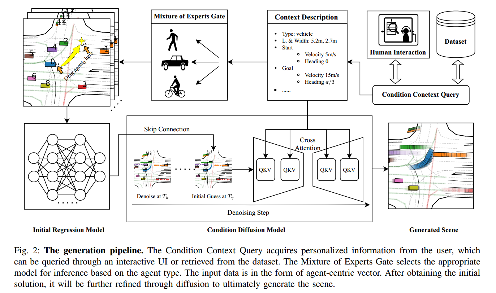

# Dragtraffic
The Repo for [Dragtraffic: Interactive and Controllable Traffic Scene Generation for Autonomous Driving](https://chantsss.github.io/Dragtraffic/).

**News**: Dragtraffic has been accepted by [**IROS2024**](https://iros2024-abudhabi.org), The training and generation code is coming soon.

[**Webpage**](https://chantsss.github.io/Dragtraffic/) | 
[**Paper**](https://arxiv.org/abs/2404.12624) |



# We are preparing
We are sorting out the code and the relevant code will be released soon in the following order:
1. - [x] Paper releasing(Accepted).
2. - [x] Model files and checkpoints. 
3. - [ ] UI and Inference demo code.
4. - [ ] Training code.

## Setup environment

```bash
# Clone the repository and set up the environment:

git clone https://github.com/chantsss/Dragtraffic
cd dragtraffic

# Create a virtual environment
conda create -n dragtraffic python=3.9.12
conda activate dragtraffic

# Install PyTorch and other dependencies
pip install torch==1.13.0+cu116 torchvision==0.14.0+cu116 torchaudio==0.13.0 --extra-index-url https://download.pytorch.org/whl/cu116 
pip install -e .
```

Test the setup with the following scripts. These do not require downloading additional data.


````bash
# Vehicle Placement Model
# Replace the data path in dragtraffic/init/configs/local.yaml
python train_init.py -c local
# Trajectory Generator Model
# The same to dragtraffic/act/configs/local.yaml
python train_act.py -c local 
````

## Quick Start

### Download dataset for road and traffic

Download from Waymo Dataset
- Register your Google account in: https://waymo.com/open/
- Open the following link with your Google account logged in: https://console.cloud.google.com/storage/browser/waymo_open_dataset_motion_v_1_1_0
- Download one or more proto files from `waymo_open_dataset_motion_v_1_1_0/uncompressed/scenario/training_20s`
- Move download files to PATH_A, where you store the raw tf_record files.

Note: it is not necessary to download all the files from Waymo. You can download one of them for a simple test.

### Data Preprocess
```bash
# python -m pdb label_trans20.py path_A path_B None
mkdir PATH_B
python -m pdb label_trans20.py /media/sheng/ssd/dataset/waymo/training_20s path_B None --debug_vis --draw_scene_pi 

Specify 'debug_vis' 'draw_scene_pi' to see the data visualization

```

### Train Dragtraffic
```bash
# Train
python -m pdb train_act.py -c local -d 0 -e quick_test -ca 1 -ei 10

Specify  '-d' for devices '-ca' for using cache, '-ei' means evaluation interval 

# Note that we found pretrain init model and diff model then finetune them together in led model.

1. Train the init model by setting model:'drag' in act/local.yaml
2. Train the diff model by setting model:'diffusion' in act/local.yaml
3. Train dragtraffic model by setting setting model:'led', init_model_path and diff_model_path obtained from step 1&2.


# Eval
python -m pdb train_act.py -c local  -d 0 -e drag_test_eval -ca 1 -ev 1 -mp MODEL_PATH

Specify  '-ev' 1 '-mp' means model path

```

### Generate new traffic scenarios

```bash
# Running following scripts will generate images and GIFs 

# Scene editing, insertion based on UI
# Refer to gradio_visualizer.py to see the hyperparameter
python gradio_visualizer.py
# Note if got unexpected keyword argument 'socket_options', try pip install --upgrade httpx httpcore

# Scene editing, insertion based on the dataset
python -m pdb ui_utils_moe.py -l 90 -p 30 -gn 10
# Use act model to generate gif, -l means length, -p means pertime length, -gn means generate nums 
# Note here you should specify the act model address in init config
```

# Citation
If Dragtraffic is helpful in your research, please consider giving us a star or citing our work:

```bibtex
@misc{wang2024dragtraffic,
      title={Dragtraffic: A Non-Expert Interactive and Point-Based Controllable Traffic Scene Generation Framework}, 
      author={Sheng Wang and Ge Sun and Fulong Ma and Tianshuai Hu and Yongkang Song and Lei Zhu and Ming Liu},
      year={2024},
      eprint={2404.12624},
      archivePrefix={arXiv},
      primaryClass={cs.RO}
}
```
